# Handwritten-digits-recognition-by-ANN-MLP
This project aims to use the perceptron learning method and design an
artificial neural network (ANN) to train a system to recognize handwritten
digits (0, 1, …, 9).

We use the three-layer feed-forward network architecture (input layer, hidden
layer, and output layer) with the multi-layer perceptron learning method and the
error back-propagation algorithm to recognize handwritten digits (0, 1,...., 9).

This project uses the MNIST database of handwritten digits for testing and
training the system attached here as "mnist_handwritten.csv." It contains 60k
images that are sorted as one vector, each with its labels. We select a subset
of the MNIST database consisting of around 10000 images of handwritten digits
(0,...,9) for training the system and use another 1000 images for testing the
system.

The input to the multi-layer network architecture will be a set of pixels
representing a 28×28 image of handwritten digits. The output should indicate
which numbers (0,....,9) are in the input image.

To have an overview of our data, first, I plotted the distribution of labels
(digits). As you can see in the figure below, overall, it is okay.

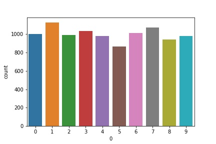

We design a fully connected network structure of input layer (784 input nodes),
hidden layer (number of hidden nodes as specified below), and output layer (10
output nodes).

hidden_node_count={10, 35, 100, 300, 500}

After selecting 10000 images as the training set and 1000 images as the testing
set, considering training_rate={0.01, 0.7, 0.5, 0.2, 0.01},
hidden_node_count={10, 35, 100, 300, 500}, epsilon 0.01, and maximum iteration
300, I followed the steps below to learn the network:

1.  Normalizing the input data

2.  Initializing the weights by generating a random number in the range of (0,1)

3.  Computing net_k by the dot product of u_ki and x\_i

4.  Applying the activation function on net_k and computing z_k

5.  Computing v_j by the dot product of w_jk and z_k

6.  Applying the activation function on v_j and computing y_j

7.  Calculating the erroe e --\> e =d_j - y\_j

8.  Calculating the erroe e\_j --\> e\_j = e \* y_j \* (1-y_j)

9.  Calculating the erroe e_k --\> e\_k = np.dot(e,w) \* z_k \* (1-z_k)

10. Computing ∆w\_jk --\> dw\_jk = beta\*np.dot(e\_j, z_k)

11. Computing ∆u_ki --\> du_ki = beta\*np.dot(e\_k, x_i)

12. Modifing the weights as follows:

    w\_jk (t+1) = w_jk(t) + (1-beta) ∆w\_jk(t) + beta ∆w\_jk(t-1)

    u_ki (t+1) = u_ki (t) + (1-beta) ∆u_ki (t) + beta ∆u_ki (t-1)

13. Repeating step 3 to 12 until e\<0.1 or iteration\>300

Some of the results have been shown in the figures and tables below (please see
the attached log file for all the results).

Also, A confusion matrix and classification report are provided for all the
scenarios to have a better vision of the results.

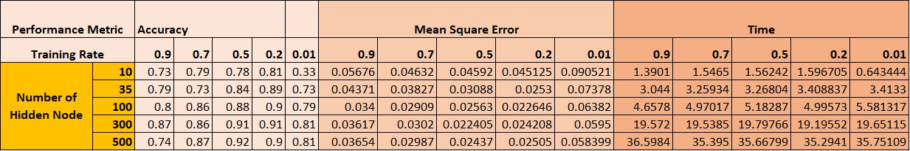

We can plot a learning curve that illustrates the mean square error versus
iterations.

(One iteration: we apply all the training inputs once to the network and compute
the mean square error).

| 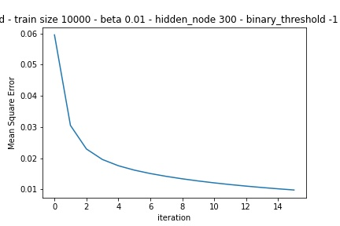 | 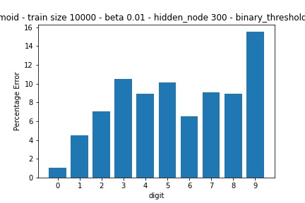 |
|-------------------------------------------------|-------------------------------------------------|

Then we plot the percentage error in testing your handwritten digit recognition
system as a bar chart.

(Mean error occurred while testing each digit with the test data).

| 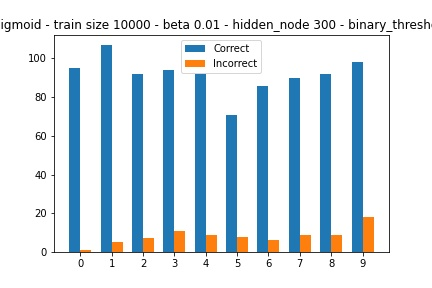 | 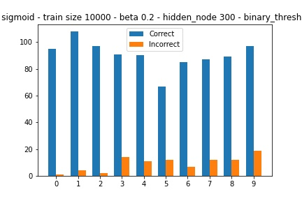 |
|-------------------------------------------------|-------------------------------------------------|

I considered 5 values {0.01, 0.2, 0.5, 0.7, 0.9} for the learning rate. As you
can see in the table below (for ten hidden nodes), overall, the lower learning
rates need more training, but the model will be more accurate. However, the
too-large learning rates lead the model to converge too quickly to a non-optimal
weight. Also, the too-small ones lead to a prolonged model, and sometimes it can
destroy the accuracy.

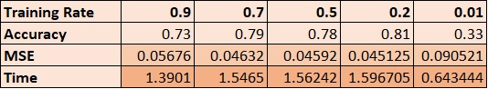

According to the results, increasing the number of hidden nodes increases the
model's accuracy, but it needs more time to be trained. Too many hidden nodes
cannot improve the model (please see the table below).

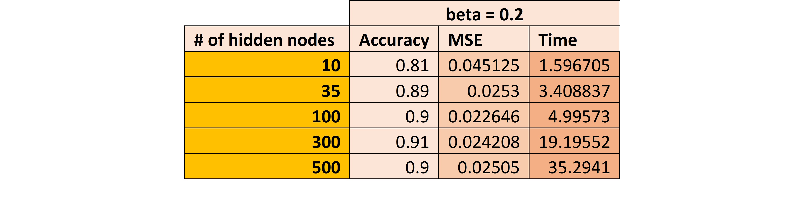

**A comparison between the MLP results with the**
[**SVM**](https://github.com/pourbemany/Handwritten-digits-recognition-by-SVM-classifier)
**and**
[**SLP**](https://github.com/pourbemany/Handwritten-digits-recognition-by-ANN-SLP)
**results**

As the table below shows, MLP is more accurate than SLP, but it needs more
training time for the same iteration number. For example, in the table below,
the 3001 iteration of SLP takes 0.219 seconds while MLP takes 0.13 seconds, only
one iteration for one iteration. In some cases, MLP can be more accurate than
SVM.

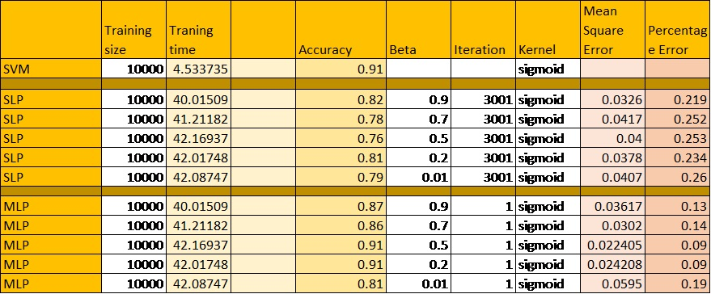

To visualize the model's result, I randomly selected six images and their
predicted labels. As you can see in the figures below, the model's performance
is as we expected.

| 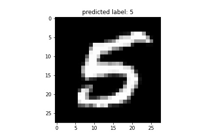                                      | 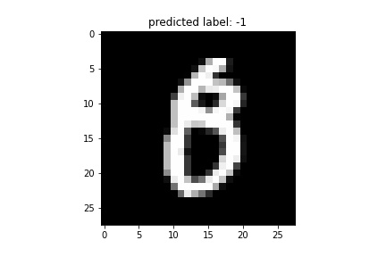 | 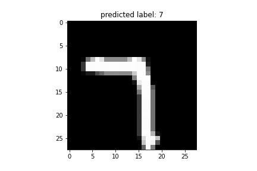 |
|--------------------------------------------------------------------------------------|-------------------------------------------------|-------------------------------------------------|
| 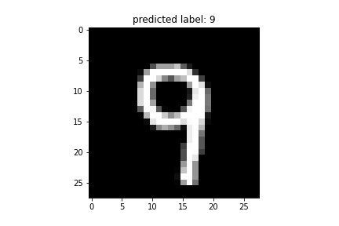                                      | 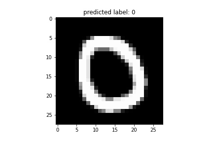 | 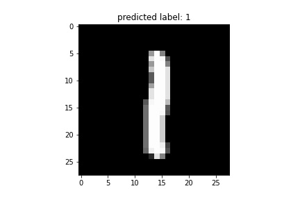 |
| *Comparing the predicted label by ANN (sigmoid – multilevel) with the actual label*  |                                                 |                                                 |

In conclusion, the size of the training set has a significant effect on the
model's performance. The learning rate can control convergence speed, and
increasing the number of hidden nodes can improve the model. Still, the accuracy
rate can be saturated after some enormous number of hidden nodes. Overall,
single-layer ANN has a weaker performance than the multi-layer ANN and the SVM.
In some scenarios, MLP can be more accurate than SVM.

**References:**

<https://www.kaggle.com/mirichoi0218/ann-slp-making-model-for-multi-classification>

<https://www.kaggle.com/shivamb/a-very-comprehensive-tutorial-nn-cnn>

<https://www.python-course.eu/neural_network_mnist.php>
